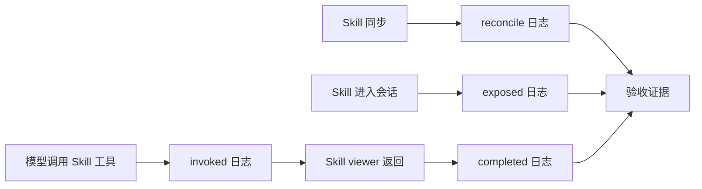
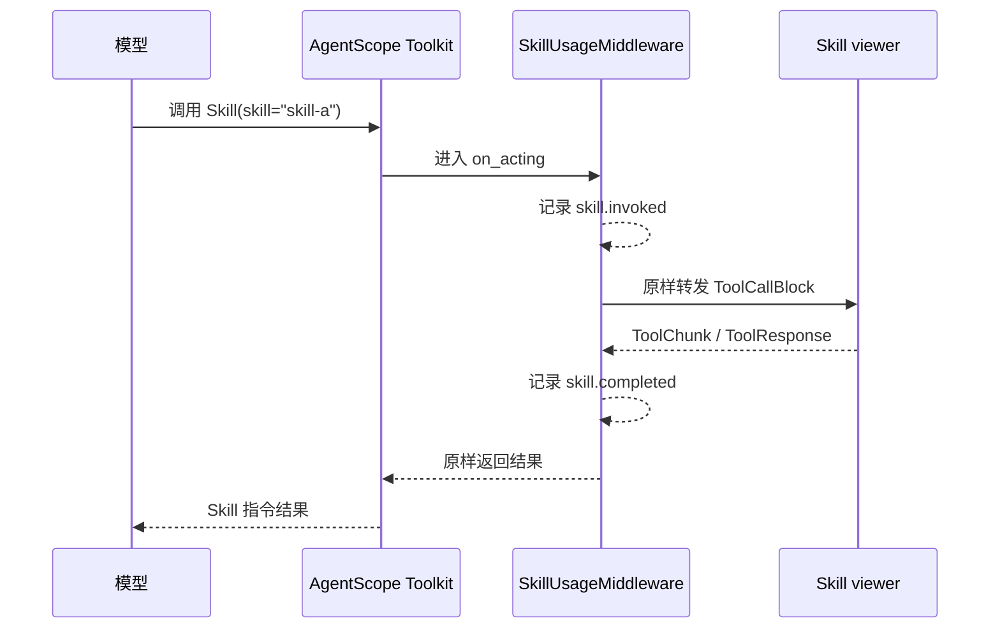

# Skill 可观测性阶段验收报告

> 验收范围：Skill 应用层可观测性基础建设
>
> 验收目标：证明观测代码可用、关键链路可追踪、日志不泄露敏感内容，且未修改 AgentScope 核心 Skill 组件。
>
> 当前结论：用户 Token 使用聚合、应用代码侧基础可观测性、PostgreSQL 事件表、管理员查询 API、可观测性前端分析页和用户失败诊断已完成专项验收；真实 PostgreSQL 联调、监控平台、OpenTelemetry Metrics 和 Trace 关联属于后续范围。

## 1. 验收总览



| 编号 | 验收项 | 状态 | 证据类型 |
| --- | --- | --- | --- |
| 1 | 自动化测试结果 | ✅ 通过 | 22 项专项测试全部通过 |
| 2 | 同步成功日志 | ✅ 通过 | 实际执行 `_sync_current_user_skills` 成功场景 |
| 3 | 同步失败或 partial 日志 | ✅ 通过 | 实际执行 `_sync_current_user_skills` partial 场景 |
| 4 | `skill.invoked` 和 `skill.completed` 日志 | ✅ 通过 | 实际执行 Middleware 观测链路 |
| 5 | 日志不包含 Prompt、Markdown 正文和凭据 | ✅ 通过 | 自动化断言 + 日志字段检查 |
| 6 | 未修改 AgentScope 核心组件 | ✅ 通过 | 核心目录变更检查无输出 |

## 2. 自动化测试结果

### 2.1 执行命令

```powershell
$env:PYTHONPATH = "src;tests"
python -m pytest `
  tests/skill_observability_test.py `
  tests/toolkit_skill_test.py `
  -q
```

### 2.2 实际结果

```text
................                                                         [100%]
18 passed in 2.67s
```

覆盖内容：

- 应用层约定要求先调用 `Skill`；
- 真实 Toolkit 中存在内置 `Skill` 工具；
- Skill 名称和描述进入 Agent 系统提示词；
- 真实 Skill viewer 返回成功；
- Middleware 原样透传 ToolChunk 和 ToolResponse；
- `skill.exposed`、`skill.invoked`、`skill.completed` 事件产生；
- 日志不包含 Skill Markdown 正文；
- 同步摘要支持 partial 结果和耗时记录。

## 3. 同步日志证据

以下日志来自本次实际执行的 `_sync_current_user_skills` 入口。
Auth、AdminService、Workspace 和 Storage 使用隔离测试替身，Skill 同步主流程、
结果判定和日志函数均使用当前代码。日志中的 `acceptance-*` 是测试标识，不是生产用户数据。

### 3.1 同步成功

```text
skill.reconcile.started user_id=acceptance-user agent_id=acceptance-agent session_id=acceptance-success
skill.reconcile.completed user_id=acceptance-user agent_id=acceptance-agent session_id=acceptance-success result=success error_code=None duration_seconds=0.0001 before_count=0 visible_count=1 after_count=1 removed_count=0 restored_count=1 installed_count=0 failure_count=0
ACCEPTANCE_RESULT session_id=acceptance-success result=success after_count=1 failure_count=0
```

关键字段：

| 字段 | 值 | 含义 |
| --- | --- | --- |
| `result` | `success` | 同步正常完成 |
| `visible_count` | `1` | 当前用户可见 Skill 数量 |
| `after_count` | `1` | 同步完成后的 Workspace Skill 数量 |
| `failure_count` | `0` | 没有子操作失败 |
| `restored_count` | `1` | 恢复的内置 Skill 数量 |
| `duration_seconds` | `0.0001` | 本次同步耗时 |

### 3.2 同步 partial

```text
skill.reconcile.started user_id=acceptance-user agent_id=acceptance-agent session_id=acceptance-partial
skill.reconcile.completed user_id=acceptance-user agent_id=acceptance-agent session_id=acceptance-partial result=partial error_code=skill_hub_not_found duration_seconds=0.0001 before_count=0 visible_count=1 after_count=0 removed_count=0 restored_count=0 installed_count=0 failure_count=1
ACCEPTANCE_RESULT session_id=acceptance-partial result=partial after_count=0 failure_count=1
```

关键字段：

| 字段 | 值 | 含义 |
| --- | --- | --- |
| `result` | `partial` | 主流程完成，但存在子操作失败 |
| `error_code` | `skill_hub_not_found` | 依赖的 Skill Hub 不存在 |
| `visible_count` | `1` | 当前用户可见 Skill 数量 |
| `after_count` | `0` | 实际进入 Workspace 的数量 |
| `failure_count` | `1` | 失败的子操作数量 |

## 4. Skill 使用链路日志证据

### 4.1 实际观测结果

```text
skill.invoked result=started user_id=acceptance-user agent_id=acceptance-agent session_id=acceptance-session skill_name=skill-a
skill.completed result=success user_id=acceptance-user agent_id=acceptance-agent session_id=acceptance-session skill_name=skill-a
```

以上两行来自本次实际执行的 `SkillUsageMiddleware.on_acting` 链路，调用输入为
`Skill(skill="skill-a")`，下游 ToolResponse 状态为 `success`。

### 4.2 使用口径



只有 `skill.invoked` 和 `skill.completed` 表示实际发生了 Skill 使用。
`published`、`visible`、`provisioned` 和 `exposed` 只表示 Skill 可用，不计入实际使用次数。

## 5. 敏感内容检查

### 5.1 日志字段检查

当前 Skill 使用日志只记录以下有限字段：

- `user_id`；
- `agent_id`；
- `session_id`；
- `skill_name`；
- `result`；
- `error_code`；
- 数量和耗时。

日志不记录：

- 完整 Prompt；
- Skill Markdown 正文；
- 模型完整输出；
- ToolResponse 正文；
- Token、密码、API Key 等凭据。

### 5.2 自动化证明

`tests/skill_observability_test.py` 已断言：

```text
Skill viewer 可以返回 Markdown 正文给模型，
但 skill.invoked / skill.completed 日志中不包含该 Markdown 正文。
```

这保证了“模型需要 Skill 内容”和“日志不保存 Skill 内容”两个边界同时成立。

## 6. 核心组件未修改证明

检查范围：

```text
src/agentscope/skill
src/agentscope/tool
src/agentscope/workspace
```

检查命令：

```powershell
git diff --name-only -- `
  src/agentscope/skill `
  src/agentscope/tool `
  src/agentscope/workspace
```

实际结果：

```text
NO_CORE_COMPONENT_CHANGES
```

本次实现集中在：

```text
examples/agent_service/skill_observability.py
examples/agent_service/main.py
examples/agent_service/skill_observability_store.py
examples/agent_service/migrations/0001_skill_observability_events.sql
tests/skill_observability_test.py
tests/skill_observability_store_test.py
```

AgentScope 核心 Skill loader、Toolkit 和 Workspace 的行为没有被改写。

## 7. 验收结论

### 本阶段已完成

- 应用层 Skill 调用约定；
- Skill 同步摘要日志；
- Skill 会话暴露和实际调用日志；
- 真实 Toolkit、Agent 和 Skill viewer 专项测试；
- Skill 观测事件 Sink、PostgreSQL 表初始化/写入和用户 Token 聚合专项测试；
- 敏感内容不进入观测日志；
- 观测代码与 AgentScope 核心组件解耦。

### 后续不属于本次基础验收的内容

- OpenTelemetry Metrics；
- request ID / trace ID 贯通；
- Skill 业务 Span；
- 管理员发布、撤销和删除审计；
- MCP 分析查询 API 和可视化；
- 真实 PostgreSQL 端到端联调；
- 完整项目测试全量通过证明。

## 8. 日志实际查看位置

当前日志使用 AgentScope 的标准 `logger`，默认配置是 `StreamHandler`，因此日志仍输出到运行进程的标准输出，不会自动写入仓库内的 `logs/` 文件。

如果配置 `SKILL_OBSERVABILITY_DATABASE_URL`，相同的观测事件会通过应用层 `SkillObservationSink` 追加写入 PostgreSQL 表 `skill_observability_events`。本次已验证 SQLAlchemy 表初始化和事件写入流程，但尚未连接真实 PostgreSQL 实例做联调。

| 运行方式 | 日志位置 | 查看方式 |
| --- | --- | --- |
| 直接运行服务 | 启动服务的终端 | 查看启动服务的终端输出 |
| Docker Compose | `agentscope` 容器标准输出 | `docker compose logs -f agentscope` |
| 专项测试 | 测试命令的终端输出 | `python -m pytest ... -s` |
| PostgreSQL 事件表 | 配置 `SKILL_OBSERVABILITY_DATABASE_URL` 后的应用层 repository | `skill_observability_events` |
| 当前验收记录 | 本文档中的实际执行结果 | 查看本文第 3、4 节 |

当前没有单独的文本日志文件，也没有接入日志检索平台；Skill 事件通过 PostgreSQL 持久化入口，并由管理员查询 API 和前端分析页读取。真实 PostgreSQL 端到端联调仍需补做。

## 9. 给上级的一句话结论

> 用户 Token 使用聚合、Skill 应用层基础可观测性、PostgreSQL 事件表、管理员查询 API、可观测性分析页和用户失败诊断已完成，相关专项测试与前端生产构建通过；Token 按用户统计、同步结果、Skill 实际调用链路、失败阶段和敏感信息保护均有验收证据，且未修改 AgentScope 核心 Skill loader、Toolkit 和 Workspace。真实 PostgreSQL 联调、MCP 分析、Trace 和 Metrics 属于后续阶段。
