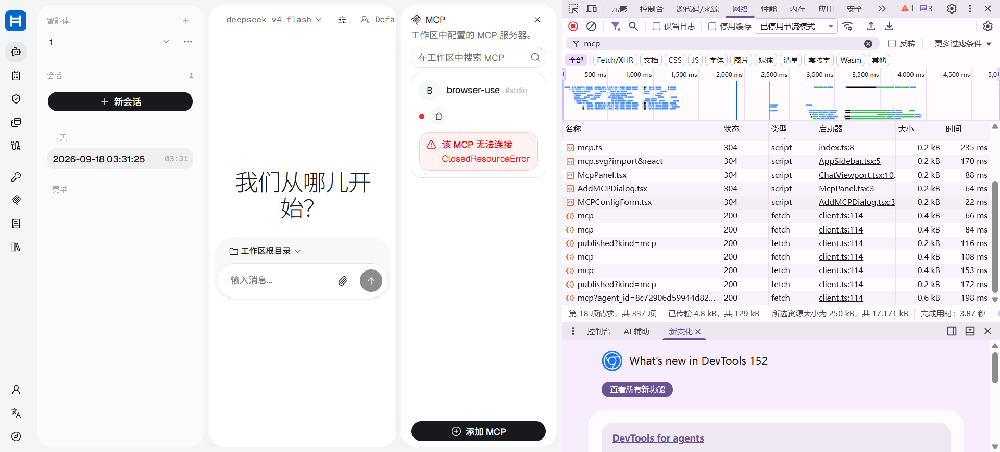
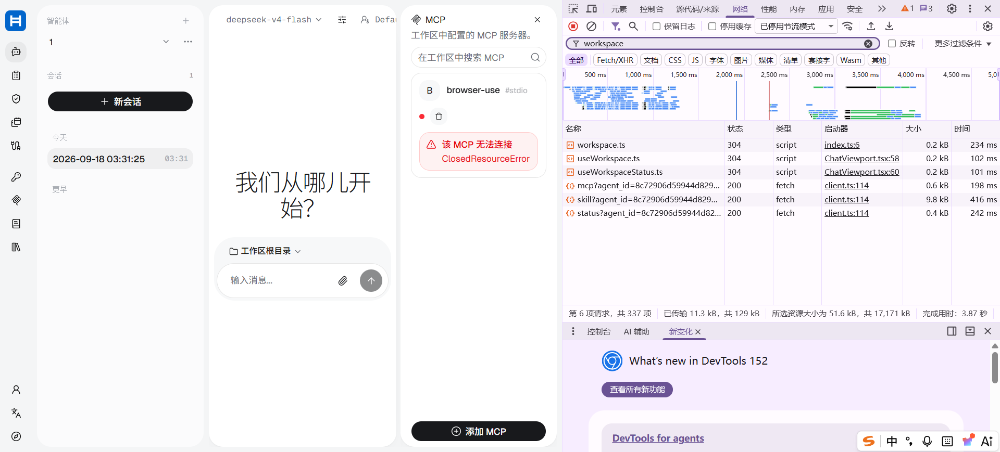

# MCP 生命周期问题记录与后续修正方案

> 记录范围：截至 2026-09-18，基于 lxscope 项目中的 MCP 使用问题、用户反馈、截图、Docker 状态和容器日志整理。
> 当前结论：MCP 的初次启动和接口访问曾经成功，但 stateful stdio MCP 在页面切换、后端重载、容器重启和资源复用后出现连接状态失真或资源关闭问题，生命周期闭环尚未完成验收。
> 本文只做问题记录和修复规划，不代表已经修改 AgentScope 主代码。

## 1. 问题总览

| 编号 | 问题 | 现象 | 当前状态 |
|---|---|---|---|
| MCP-01 | 管理中心分配 MCP 失败 | 选择全部用户或指定用户后出现 Cannot reach the server；刷新后仍不展示给用户 | 未确认根因 |
| MCP-02 | 页面切换后资源失效 | 安装并重启后正常，切换页面再回到会话显示 ClosedResourceError | 高优先级未闭环 |
| MCP-03 | 后端重启期间前端不可达 | 重启后显示无法连接到龙信助手服务器 | 需区分启动窗口与持续故障 |
| MCP-04 | 初次连接成功但状态失真 | 日志有 MCP connected，但前端仍显示 ClosedResourceError | 已确认不稳定 |
| MCP-05 | MCP 关闭时 AnyIO cancel scope 错误 | 出现 cancel scope 不是当前 task，或在不同 task 中退出 | 高优先级未修复 |
| MCP-06 | 容器健康状态与接口状态不一致 | agentscope 曾 unhealthy，但多个 HTTP 接口仍返回 200 | 需分层健康检查 |
| MCP-07 | 工具列表为空导致 Task 无 ToolStep | tools 为空时自动规划只能退化为 AgentStep/PythonStep | 依赖 MCP 恢复 |

## 2. 关键故障时间线

### 2.1 管理中心分配问题

用户反馈：管理中心将 MCP 分配给用户时，不论选择全部用户还是指定用户，都会弹出：

    Cannot reach the server. Check the server address and your network.

强制刷新后仍显示为不展示给用户。

需要核对的链路：

    管理中心选择用户
      -> 分配/发布接口
      -> 后端保存 MCP 可见范围
      -> 用户侧查询 published MCP
      -> 用户会话加载

已有日志可以看到 /resources/published?kind=mcp 和 /mcp 返回 200，但这只能证明查询接口可达，不能证明分配写入成功或用户权限已经生效。

### 2.2 页面切换后 ClosedResourceError

用户反馈：安装 MCP 后重启容器，MCP 显示正常；切换管理中心或其他页面，再回到会话，显示：

    该 MCP 无法连接
    ClosedResourceError

截图中的事实：

- MCP 名称是 browser-use，类型标识为 stdio。
- 前端报 ClosedResourceError。
- /mcp、/workspace/mcp、/workspace/status 等请求曾返回 200。
- HTTP 请求可达不代表后端持有的 MCP client、transport 或子进程仍然可用。

### 2.3 重启后暂时无法连接服务器

重启后端时前端曾显示：无法连接到龙信助手服务器，请稍后重试。

之后 Docker 状态恢复为 agentscope healthy、redis healthy、web-ui healthy。

这说明至少有一部分是启动时序问题：前端在后端 readiness 完成前发起请求，随后没有自动重新探测或重试。需要区分启动中、暂时不可达和 MCP 连接失败。

### 2.4 Playwright MCP 可执行文件检查

在 agentscope 容器内执行了以下检查：

    docker compose -f docker-compose.yml -f docker-compose.dev.yml exec agentscope sh -lc "command -v node; command -v npx; node --version; npx --yes @playwright/mcp@latest --help"

检查结果：

    /usr/local/bin/node
    /usr/local/bin/npx
    v20.20.2
    Usage: Playwright MCP [options]

结论：Node、npx 和 Playwright MCP 命令可以启动，问题不能简单归因于容器缺少 Node 或 MCP 包不存在。这也不能证明 MCP transport 在应用生命周期内一直存活。

### 2.5 实际 MCP 配置状态

用户提供的状态为：

    name: browser-use
    is_stateful: true
    type: stdio_mcp
    command: npx
    args: --yes @playwright/mcp@latest --headless --no-sandbox --browser chromium
    is_healthy: false
    tools: []
    error: ClosedResourceError

重点：这是一个需要复用资源的 stateful stdio MCP；健康状态为 false，工具列表为空，错误是资源已经关闭。

## 3. 服务端日志证据

### 3.1 初次连接成功

日志出现：

    MCP connected: browser-use
    GET /mcp HTTP/1.1 200 OK
   GET /resources/published?kind=mcp HTTP/1.1 200 OK

    GET /workspace/mcp?... HTTP/1.1 200 OK

这说明 MCP 至少在某个时刻完成过连接，相关 HTTP 路由也可以响应。初次连接成功不等于生命周期稳定。

### 3.2 关闭时的 cancel scope 错误

后端 reload 或关闭时出现：

    Error closing MCP 'browser-use': Attempted to exit cancel scope in a different task than it was entered in
    MCP closed: browser-use

这说明关闭动作确实被调用，但退出资源时可能处于不同的 asyncio task 或 cancel scope。

### 3.3 ASGI 请求处理中的 RuntimeError

服务端还出现：

    ERROR: Exception in ASGI application
    RuntimeError: Attempted to exit a cancel scope that isn't the current tasks's current cancel scope

需要确认：MCP client 和 transport 在哪个 task 中创建、哪个 task 中进入、哪个 task 中关闭；以及 stateful client 是否被放进了跨请求共享对象，却在请求结束时被关闭。

### 3.4 容器健康检查超时

docker inspect 的健康记录中出现：

    Status: unhealthy
    TimeoutError: timed out
    urllib.request.urlopen(...)

与此同时应用日志中仍有多个 200 响应。因此 running、healthy、HTTP 200、MCP connected、MCP healthy 和 MCP callable 必须分开判断。

## 4. 已执行的排查和处理记录

- 重启过 agentscope 容器。
- 使用 docker compose ps 检查 agentscope、redis、web-ui 状态。
- 使用 docker inspect 查看容器健康检查失败原因。
- 在容器内确认 Node、npx 和 Playwright MCP 可以启动。
- 过滤 ClosedResource、McpError、RuntimeError、Traceback、MCP 等关键字。
- 观察到 MCP connected: browser-use。
- 观察到 MCP close 阶段的 cancel scope 错误。
- 观察到 ASGI application 的 cancel scope RuntimeError。
- 观察到 /mcp、/workspace/mcp、/resources/published 多次返回 200。
- 确认 MCP 工具列表为空时，Task 自动规划无法生成真正的 ToolStep。
- 当前尚未修改 AgentScope 主代码。
- 当前尚未确认管理中心分配失败的写入接口和数据库状态。
- 当前尚未完成 stateful MCP 在多次页面切换、reload、重连下的稳定性验收。

## 5. 当前判断

### 已确认事实

1. browser-use 是 stateful stdio MCP。
2. 容器内 Node、npx 和 Playwright MCP 命令可执行。
3. MCP 曾经成功连接。
4. 页面重新进入会话时可能显示 ClosedResourceError。
5. MCP 关闭时存在 cancel scope 跨 task 退出错误。
6. HTTP 200 不代表 MCP resource 仍可用。
7. MCP 不健康时 tools 为空，Task 无法依赖它生成 ToolStep。
8. 容器健康检查曾超时，且与接口返回 200 同时出现。

### 尚未确认的原因

以下都是排查假设，暂不能当作最终结论：

- 是 AgentScope 原始 MCP 生命周期实现的问题。
- 是 lxscope 业务层跨请求、跨 session 或页面进入时错误复用了 client。
- 是 Uvicorn reload 关闭旧进程时触发跨 task cancel scope。
- 是 anyio、Starlette、Uvicorn 或 MCP SDK 版本组合导致。
- 是 Chromium/MCP 子进程异常退出后没有重新创建 client。
- 管理中心分配失败是权限、发布状态、缓存还是接口异常。
- Docker healthcheck 超时是 MCP 阻塞、模型请求超时，还是独立问题。

## 6. 建议的生命周期模型

建议把 MCP 生命周期明确建模，而不是只保存 is_healthy 布尔值：

    configured
      -> assigned/published
      -> discovered
      -> connecting
      -> initializing
      -> ready
      -> calling
      -> idle
     -> degraded
      -> reconnecting
      -> ready

任意阶段都可以进入 closing、closed 或 removed。

建议记录：mcp_id、scope、is_stateful、lifecycle_state、owner_id、owner_task_id、created_at、last_used_at、connected_at、last_error_type、last_error、reconnect_count、tool_count、process_id、transport_id、generation。

## 7. 后续修正事项

### P0：必须优先处理

#### P0-1：修复 stateful stdio MCP 的 owner 和关闭边界

- client、transport、stdio 子进程由明确的长期 owner task 管理。
- 创建和关闭发生在同一个生命周期上下文。
- 请求结束、页面卸载、前端路由切换不能直接关闭 stateful MCP。
- 只有 workspace/session 生命周期结束、MCP 被删除或服务进程关闭时才 close。

验收：页面切换不触发 MCP close；reload/shutdown 可以正常关闭；不再出现 cancel scope 跨 task 错误；同一个 MCP 不出现多个并发 owner。

#### P0-2：ClosedResourceError 自动恢复

检测到 ClosedResourceError 时应：

1. 将旧 client 标记为 closed 或 degraded。
2. 清理旧 transport 和旧工具列表。
3. 防止前端继续使用旧 client。
4. 重新创建 client 并 initialize。
5. 重新加载 tools。
6. 成功后更新为 ready，失败后保留可读错误和重试信息。

不能只返回 is_healthy=false 和 ClosedResourceError。

#### P0-3：区分连接成功和可用

至少区分 process_started、transport_connected、initialized、tools_loaded、healthy、callable、closing、closed。只有 initialize 完成且工具加载成功，才能把工具交给 Task Planner。

#### P0-4：补充分配/发布链路验证

分配后必须验证：分配请求成功、持久化成功、published 查询可见、指定用户可见、用户会话加载可见。失败时前端应展示实际接口错误，不要统一显示 Cannot reach the server。

### P1：稳定性和可观测性

- 进入会话时重新读取 MCP 状态，不能复用过期错误状态。
- 对后端启动中的情况有限重试。
- 对 ClosedResourceError 提供重新连接动作。
- 显示连接时间、工具数量和最近错误。
- 分开 liveness、readiness、MCP readiness、tool readiness。
- 统一记录 mcp_name、mcp_id、user_id、workspace_id、agent_id、session_id、client_generation、owner_task_id、transport_id、lifecycle_state。

### P2：测试和回归

| 场景 | 预期 |
|---|---|
| 安装 stdio MCP | 初始可见，工具列表非空 |
| 分配给全部用户 | 全部目标用户可见 |
| 分配给指定用户 | 只有目标用户可见 |
| 页面切换 10 次 | 不出现 ClosedResourceError |
| 同一会话重复进入 | 复用或重连成功，无孤儿 client |
| 后端重启 | 服务 ready 后 MCP 自动恢复 |
| MCP 子进程退出 | degraded 并自动重连 |
| 工具调用失败 | 不误关整个 client |
| 非 stateful MCP | 不受 stateful 生命周期逻辑影响 |
| Task AgentStep -> ToolStep -> PythonStep | 上一步输出正确传递 |
| MCP 删除 | 所有 client 正常关闭，无 cancel scope 错误 |

## 8. 与 Task 模块的关系

Task 支持 AgentStep、ToolStep、PythonStep，但 ToolStep 依赖可用的 MCP 工具列表。

    MCP 不健康或 tools=[]
      -> Planner 没有可选工具
      -> 不会生成可执行的 ToolStep
      -> 任务退化为 AgentStep + PythonStep

这不是 Task 三种 Step 代码不存在，而是 MCP 生命周期异常导致 Task 没有可用工具输入。

Task 后续应：

- 在 Planner 输入中明确标记工具状态。
- 无可用工具时提示当前没有可用 MCP 工具，不要静默生成纯 Agent 流程。
- ToolStep 保存和执行前校验工具是否存在。
- 工具执行失败时关联记录 MCP 错误和 Task 节点错误。
- 对 ToolStep 支持一次受控重连后重试，避免重复执行有副作用的工具。

## 9. 当前不建议直接做的事情

- 在根因确认前直接修改 AgentScope 主代码中的 MCP close 逻辑。
- 把所有 MCP 改成非 stateful。
- 只靠前端强制刷新掩盖后端 client 已关闭。
- 每次页面进入都无条件创建新的 MCP 子进程。
- 通过全局单例无限期持有所有用户的浏览器进程。
- 仅依据 docker compose ps 的 healthy/unhealthy 判断工具是否可调用。

建议先在 lxscope 业务层增加状态观测和重连编排，用 fake MCP 或最小 stdio MCP 完成生命周期测试；确认根因后，再讨论 AgentScope 主代码的最小改动。

## 10. 原始截图

### 10.1 MCP 面板显示 ClosedResourceError

### 10.2 切换页面后的 workspace 请求

## 11. 原始会话和日志附件

以下文件是从用户会话附件中归档的原始记录：

- [01-task-run-and-reload-log.txt](raw/01-task-run-and-reload-log.txt)：Task 执行、后端 reload 和 MCP close 记录
- [02-unhealthy-inspect-log.txt](raw/02-unhealthy-inspect-log.txt)：Docker health 状态为 unhealthy 的 inspect 输出
- [03-compose-ps-log.txt](raw/03-compose-ps-log.txt)：Docker compose 服务状态记录
- [04-health-inspect-log.txt](raw/04-health-inspect-log.txt)：容器健康检查记录
- [05-mcp-traceback-log.txt](raw/05-mcp-traceback-log.txt)：MCP connected 后 ASGI/AnyIO traceback
- [06-mcp-tail-log.txt](raw/06-mcp-tail-log.txt)：后续容器日志和 MCP 请求
- [07-task-run-timeout-and-reload-log.txt](raw/07-task-run-timeout-and-reload-log.txt)：Task 超时、重试和服务 reload 记录

## 12. 结论

当前最核心的问题不是 Playwright MCP 命令能否启动，而是 stateful stdio MCP 在跨请求、跨页面、后端 reload 和服务关闭时，谁拥有 client、谁负责关闭、何时重连，以及前端如何获得真实状态，目前没有形成稳定且可观测的生命周期闭环。

建议下一步先完成 P0-1 和 P0-2 的最小复现与修正，再处理管理中心分配可见性问题，最后补齐健康检查和回归测试。
